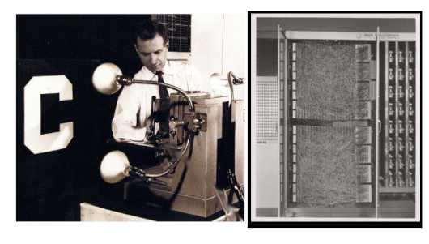

# A Primer on Backpropagation with a Numerical Example, Diagrams and Python Code
A self-contained introduction to the well-known backpropagation algorithm illustrated step by step, providing the mathematical elements necessary for understanding and a numerical example with which to verify what has been learned. A Python script with Keras and TensorFlow to verify the calculations performed completes the exposition (available on GitHub). 

https://medium.com/@nicolasanti_43152/254c0ea2fa49

# Introduction 
Backpropagation, short for backward propagation of errors, is perhaps the most iconic algorithm of modern machine learning. Suffice it to say that, until the mid-1980s, no one believed in the possibility of training a multilayer network anymore! The story is very interesting and reveals how a mistaken belief can delay scientific development even by decades. 

Although the first simple artificial neural network dates back to Mcculloch and Pitts (1943), it was with Rosenblatt (1962) that the theory and hardware needed to implement the first neural network called perceptron were developed. The hardware needed to implement it is depicted in the photos below where we can also see Charles Wightman (project engineer) adjusting Mark I Perceptron: 

Perceptron has several layers but only one trainable so, in modern terms, it is a one-layer neural network, obviously subject to major limitations formally demonstrated by Minsky and Papert (1969). And here we come to the exact moment when machine learning based on neural networks was in danger of being completely abandoned because the two authors firmly believed, although without providing proof, that the same limitations of perceptron would also apply to neural networks with more than one layer (deep learning). 

This widespread belief led to a suspension of interest, funding and research in the period from 1970 to the first half of the 1980s. Among other things, researchers could not pursue the study of multilayer 1 models because there was no way to train them: the techniques used by perceptron were not applicable except for networks with only one layer. 

Then, as sometimes happens, a series of innovations contributed to the revival of neural networks and, among these, the most relevant was the invention1 of the backpropagation algorithm by Rumelhart, Hinton, and Williams (1986). The activation and loss functions had already been made differentiable, and backpropagation allows the derivative (more precisely the gradient) of the loss function to be calculated by moving backwards from the errors (difference between the value predicted by the model and the actual value), going up from the last layer to the first. The most relevant aspect, as we shall see in this article, is the possibility of reusing the calculations already made by the neural network in its forward pass (from the first layer to the last) to calculate the gradient, which saves resources and makes it possible to handle even very deep neural networks. 

We will begin our exposition by recalling the few elements of mathematics necessary for understanding, which are limited to the multiplication of matrices and vectors and the calculation of derivatives of linear functions. We will then formally define a multilayer neural network and focus on a numerical example with two layers. We will use what we have learned to obtain two simple and important derivatives to be used in the last paragraph to obtain the complete backpropagation algorithm. We will test our understanding through some elementary calculations on the example model, followed by a short Python script to verify their correctness. 

Let us proceed, then :-)